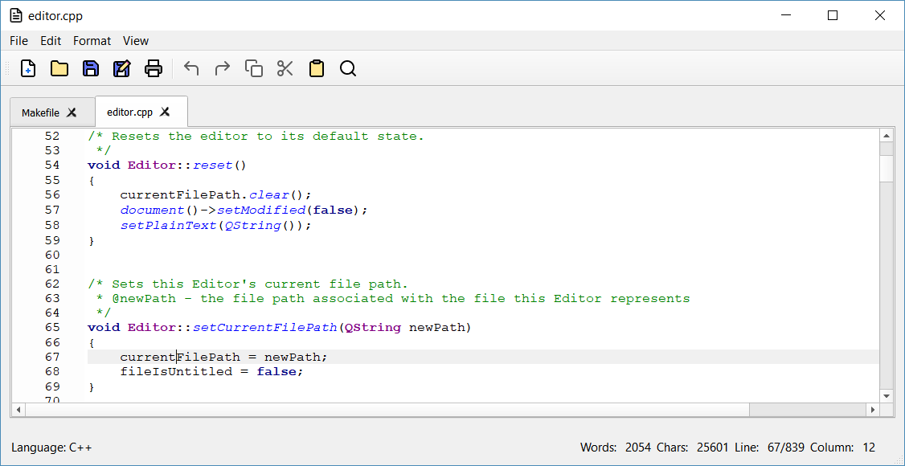

# Scribe

Scribe is a simple, user-friendly text editor for Windows users.

Basic syntax highlighting for four languages: C, C++, Java, and Python.

## Development

### Getting started

This project was developed in Qt5 using [Qt Creator](https://www.qt.io/download-qt-installer?hsCtaTracking=9f6a2170-a938-42df-a8e2-a9f0b1d6cdce%7C6cb0de4f-9bb5-4778-ab02-bfb62735f3e5).

All code is written in C++ using the [Qt framework and its libraries](http://doc.qt.io/).

To contribute your own code to the project:

1. Fork the repository here on Github.
2. On the command-line, navigate to your desired project directory and input the following command: `git clone https://github.com/YourUsername/Scribe-Text-Editor`.
3. Push changes to your forked repo, and then submit a pull request.

## Credits

All application icons are open source. Credits go to [Feather Icons](https://feathericons.com/), created by Cole Bemis.

The code for highlighting the current line and numbering the margins on the left was borrowed from the official [Qt Code Editor Example](http://doc.qt.io/qt-5/qtwidgets-widgets-codeeditor-example.html) tutorial. All other code is original.
